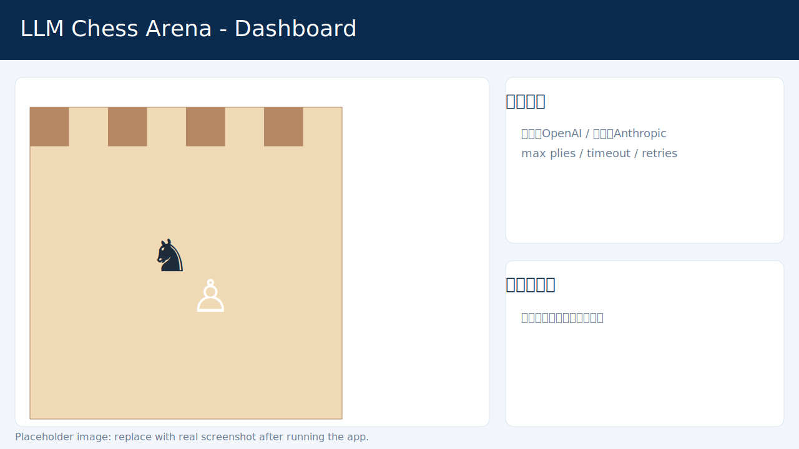
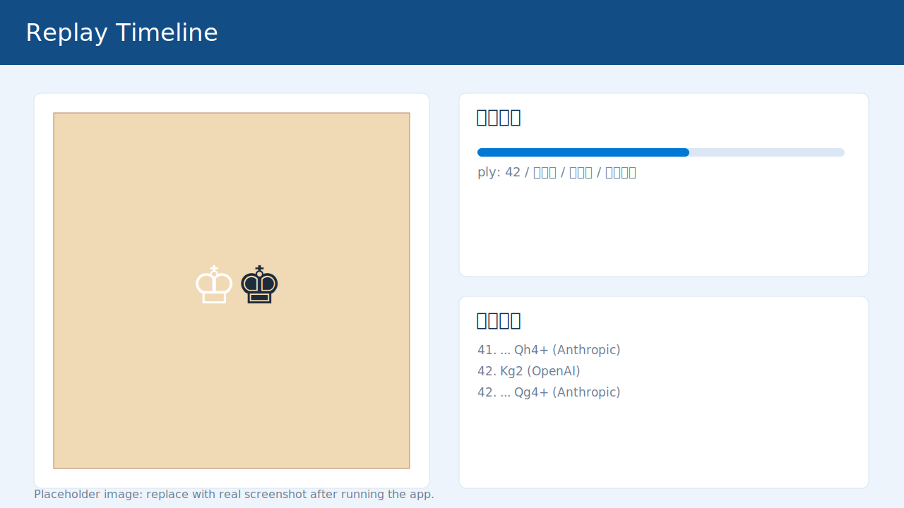

# LLM Chess Arena（Node.js）

一个用于 **LLM 自动国际象棋对战** 的 Node.js 应用，支持：

- 配置 **OpenAI / Anthropic / Gemini / mock-random** 作为黑白双方
- 可视化棋盘观战
- 完整记录对局过程（SAN/UCI、FEN 快照、模型原始输出、耗时）
- 可回放（滑块 / 单步 / 自动播放）

> English README: [README.md](./README.md)

---

## 功能特性

- **双边独立配置**
  - 白方、黑方可分别设置 provider / model / apiKey
  - apiKey 可从 UI 输入，也可走后端 `.env`
- **实时棋盘可视化**
  - 真正 8x8 棋盘
  - 最近一步 from/to 高亮
  - 着法表点击可跳转回放
- **对局持久化**
  - 自动写入 `data/games/<gameId>.json`
  - 包含快照和元数据，便于复盘
- **稳健兜底机制**
  - 非法着法先重试
  - 仍失败则随机合法着法兜底，保证对局不中断

## 界面预览

> `docs/screenshots/` 里放了占位图。你可以运行后替换为真实截图。

### 主界面



### 回放界面



---

## 技术栈

- Node.js（ESM）
- Express
- chess.js
- 原生前端（无打包）
- Playwright（UI 冒烟测试）

---

## 快速启动

```bash
cd llm-chess-arena
npm install
cp .env.example .env
# 填入 API Key
npm run dev
```

浏览器访问：`http://localhost:3000`

> 注意：请使用 `npm run dev`，不要用 `npm dev`。

### Windows 一键启动

- `start-dev.bat`
- `start-dev.ps1`

两个脚本都会自动：

1. 若缺少 `.env`，从 `.env.example` 复制生成
2. 执行 `npm install`
3. 执行 `npm run dev`

---

## 配置项说明

每一方支持：

- `provider`: `openai | anthropic | gemini | mock-random`
- `model`: 模型名（可空，走 `.env` 默认）
- `apiKey`: 可选（可空，走服务端 `.env`）

对局级参数：

- `maxPlies`：最大总步数
- `moveTimeLimitMs`：单步超时
- `maxRetries`：非法着法重试次数

---

## 环境变量

请参考 `.env.example`，主要包括：

- `OPENAI_API_KEY`, `OPENAI_BASE_URL`, `OPENAI_MODEL`
- `ANTHROPIC_API_KEY`, `ANTHROPIC_BASE_URL`, `ANTHROPIC_MODEL`
- `GEMINI_API_KEY`, `GEMINI_BASE_URL`, `GEMINI_MODEL`
- `PORT`

---

## API 列表

- `GET /api/health`
- `POST /api/game/start`
- `GET /api/game/:id`
- `GET /api/game/:id/replay`
- `GET /api/games`

---

## 回放数据结构

每局 JSON 包含：

- 对局元数据（双方模型、状态、结果）
- `moves[]`：每步 SAN/UCI、前后 FEN、耗时、是否兜底
- `snapshots[]`：用于回放的局面时间线
- 最终 PGN

---

## Playwright 调试

```bash
npx playwright install
npm run test:ui
```

内置最小用例：`tests/ui.spec.js`

---

## 安全建议

- 不要提交 `.env`
- 项目已在 `.gitignore` 忽略 `.env`
- 推荐优先使用服务端 `.env`，前端不直接暴露密钥

---

## 可扩展方向

- 多局联赛 + Elo 估计
- 开局库 / tablebase 对比
- UI 导出/导入 PGN
- WebSocket 实时推送（替代轮询）
- 引擎评估分（side-by-side）